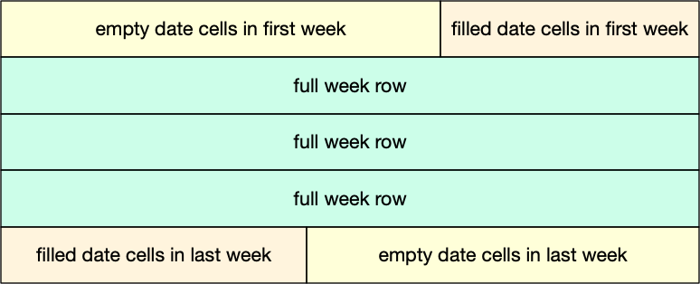

# Technical note: perpetual calendar

This problem required some basic analysis first. What does a calendar look like? 

Its first row, corresponding to the first week of the month, may have some empty cells. If the first Sunday of the month is *not* the first day of the month, there will be anywhere from 1 to 6 empty cells in the first row. Exactly how many, is a matter of further analysis.

There may be empty cells in the last row of the calendar.



Between the first row and the last row, there are 2-3 rows that are full, i.e., each day cell has a date.

The number of empty day cells $E$ in the first row of the calendar is determined by the formula

$$
E = (N+1-\text{Sunday}_1)\ \%\ N
$$

where $N$ is the number of days in a week ($N=7$). $\text{Sunday}_1$ is the date of the first Sunday of the month and its value range is $1\leq\text{Sunday}_1\leq N$. The operator $\%$ is the modulo operator. The derivation of the formula is descibed in the ``Javadoc`` for method ``printFirstWeekBlankCells``.

The posted solution is based on five methods, one for each of the five parts of the calendar above.

* ``printFirstWeekBlankCells`` prints the blank cells of the first week of the month.

* ``printFirstWeekFilledCells`` prints the dated cells of the first week of the month.

* ``printFullWeeks`` prints full weeks, ie rows where every day cell has a date.

* ``printLastWeekFilledCells`` prints the dated cells of the last week.

* ``printLastWeekBlankCells`` prints the blank cells of the last week of the month.

There are a few more methods for decorating the printout, such as ``printHeader``, ``printFooter``, and ``padded``.

## Compliance with specifications

The assignment specified no use of `if`-statements. required the use of ``for``-loops, and mandated the use of method ``padded``. The posted code complies with these three specs. There are no `if`-statements throughout the code. Only ``for`` loops are used. And method ``padded`` is used to surround a date with blank space.

## Use of constants

The code uses several constants to avoid magic values. The only literals found in the code are the numbers 0, 1, and the space string (``" "``). Everything else is a named variable.

## No use of ``if``-statements

The challenge in this assignment is to avoid the use of ``if``-statements. However we are free to use ``for``-loops. These are conditional operations, therefore they act as if-statements.

The ``for`` statement in Java has the following form:

```
for (initialization; termination; increment) {
    statement(s)
}
```
*(Source [Oracle, Java, The For Statement](https://docs.oracle.com/javase/tutorial/java/nutsandbolts/for.html)).*

The loop runs for as long as the ``termination`` condition evaluates to ``true``. Somewhere inside the loop mechanism there is a decision making process:

```
if termination condition satisfied:
  stop and exit loop
else: 
  run loop one more tim
```

Another place where `if`-statements are hidden is the `Math.min` function used in the code. The function is basically a fully branched `if` statement, for example:
```java
int simpleMax(int a, int b) {
  if (a > b)  // By the way, we should not write 
    return b; //   methods with multiple returns
  return a;   //   if we can write a single one only
}
```

## Assessment guidelines

### Red-level issues

* Program does not compile/execute.
* Program has minimal or no comments.
* Program has non descriptive variable names, such as single-letter names -- ok to use them for loop indices though.
* Program has 3 or fewer methods.
* Program uses if-statements.
* You did not perform some analysis to identify the five parts of the calendar, or to explore the relation between the date of the first Sunday and the number of empty cells on the first row.

### Yellow level issues

* Program executes but results are not as expected and significantly different from specs.
* Program has magic values.
* Program does not use provided method ``padded``.

### Green level issues

* No Javadoc
* Output is close to specified but not identical
